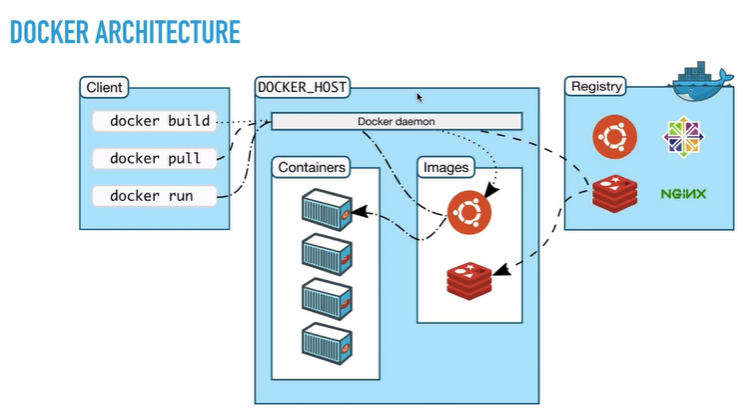

# Teentang Docker

Digunakan untuk deploy aplikasi ke server dengan melakukan bundling seluruh dependency yang dibutuhkan oleh aplikasi tersebut. Docker adalah container manager bukan virtual machine, sedanggkan pada VM biasanya disebut dengan VM manager. Dalam VM biasanya berisi OS, App dependency, dan Aplikasinya, sedangan pada Docker atau Container Manager tidak memiliki OS. Nah lantas dari mana OS yang akan digunakan oleh Container Manager, OS yang digunakan diperoleh dari OS induk dari Container Manager yang dibuat dengan cara isolate, sehingga tidak akan merusak OS induk.

## Installasi Docker

Ikuti langkah-langkah installasi sesuai dengan dokumentasi, kemudian lanjutkan dengan pengecekan pada Terminal menggunakan perintah:

    $ docker info

Apakah sudah dapat menampilkan info dari docker, bisa juga dengan perintah berikut untuk melakukan pengecekan server:

    $ docker --version

## Docker Architecture

Saat installasi docker dilakukan, sebenarnya terjadi installasi dua buah aplikasi docker, yaitu `docker client` dan `docker server` atau `DOCKER_HOST`. Pada dasarnya yang akan lebih banyak digunakan adalah `docker client` pada laptop sedangkan `docker server` mungkin akan lebih banyak dipakai pada di server atau production environment. Di karenakan oleh proses development maka perlu dilakukan installasi `docker client` dan `docker server` pada laptop developer.

+ `Docker client` biasanya berfungsi melakukan perintah ke `docker server`.
+ Sedangakan `docker server` berfungsi memanage container atau bertindak sebagai container manager. Lebih detailnya dia akan melakukan management `image`, `container`, dan juga terhubung dengan `registry`.

Berikut adalah ilustrasi dari Docker Architecture:

## Docker Registry atau Container Registry

`Container registry` adalah tempat untuk menyimpan image docker, jadi *image ini dibuat untuk membundle aplikasi sebelum dilakukan deploy ke `docker server`*. Jadi hal ini bertujuan untuk pemakaian yang berkelanjutan, dimana setiap image dapat dipakai berulang ke setiap node. Maka setiap image disimpan dalam `registry` dan setiap server yang membutuhkan tinggal mengambil saja ke dalam `registry`. Selain itu docker registri juga berfungsi untuk sharing image antar developer.

+ [Docker Hub](https://hub.docker.com/)
+ [Google Container Registry](https://cloud.google.com/container-registry)
+ [Amazon Elastic Container Registry](https://aws.amazon.com/ecr/)

## Image

Seperti yang sudah dibahas sebelumnya image adalah *bundle dari aplikasi yang siap dijalankan tanpa perlu di install*, tidak seperti installer atau ISO images. Pada docker image sendiri terdapat istilah `tags` yang dapat diasumsikan sebagai versi dari aplikasi yang dibundle tersebut. Misalkan terdapat docker image dari Python dengan versi 3.6, tetapi dalam docker registry yang dicontohkan oleh Docker Hub terdapat berbagai versi seperti python for windows server bahkan sampai dengan python versi 2.0. Kemudian dalam `docker server` juga dapat dilakukan deployment docker image untuk satu aplikasi namun dengan berbagai macam `tags`.

## Container

Definisi dari `container` sendiri adalah image yang sebelumnya terdapat pada `docker registry` itu dijalankan atau running pada `docker server`, bisa disebut juga dengan instasiasi image. Selanjutnya jumlah dan jenis image yang dijalankan selanjutnya disebut dengan container tersebut, tidak hanya berjumlah 1 tapi dapat berjumlah banyak dan dengan jenis yang sama.

# Penggunaan Docker

Berikut adalah contoh langkah-langkah dalam penggunaan docker.

## Ambil Images dari Registry

Melihat list image yang kita miliki dengan perintah berikut:

    $ docker images

Kemudian buka `Docker hub` dan cari images yang ingin di download, misalkan contoh pada perintah berikut adalah mongodb:

    $ docker pull mongo

Dengan perintah tersebut maka versi atau tags yang d gunakan secara default adalah `lates`. Jika kita ingin mendownload versi yang lain (contoh: v4.4.4), maka dapat menggunakan perintah berikut:

    $ docker pull mongo:4.4.4

## Membuat Container

Menampilkan seluruh container yang sedang berjalan dapat dengan menggunakanan perintah berikut:

    $ docker container ls

Sedangkan untuk melihat seluruh container, bahkan yang sedang tidak berjalan maka gunakan perintah berikut:

    $ docker container ls --all

Gunakan perintah berikut untuk membuat container:

    $ docker container create mongo:4.1

Namun perintah tersebut akan membuat random name untuk container. Maka dari itu gunakan perintah berikut dengan tambahkkan opsi `--name`:

    $ docker container create --name mongoserver1 mongo:4.4.4

**Note:** Nama disini bersifat unik dan tidak bisa disamakan.

## Menjalankkan Container

Untuk menjalanlan container dapat menggunakan perintah berikut, dicontohkkan dengan nama container yang sebelumnya dibuat:

    $ docker container start mongoserver1

Kemudian gunakan perintah sebelumnya untuk melihat apakah container tersebut sudah berjalan:

    $ docker container ls

Kemudian coba akses mongodb tersebut (dapat mengguunakan Studi 3T atau cara yang lain) pada alamat `localhost:27017`. Tetapi hal ini gagal dilakukkan karena pada dasarnya port yang diekspose oleh mongoDB tersebut adalah port pada tingkat containernya saja. **Jadi pastikan saat menjalankan container lakukan juga expose port pada container yang ingin dijalankan**.

## Menghapus Container

Kemudian terdapat cara untuk menghapus container dengan perintah:

    $ docker container rm mongoserver1

Namun hal ini masih belum dapat dilakukan dikarenakan container tersebut masuh berjalan, maka stop dulu container yang sedang berjalan dengan perintah berikut:

    $ docker container stop mongoserver1

Dapat juga melakukan stop untuk dua container sekaligus dengan perintah berikut:

    $ docker container stop mongoserver1 mongoserver2

Kemudian baru lakukan penghapusan terhadap dua container tersebut:

    $ docker container rm mongoserver1 mongoserver2

## Membuka atau Expose Port untuk Container

Gunakan perintah berikut untuk membuat container sekaligus melakukan expose pada port tersebut:

    $ docker container create --name mongoserver1 -p 8080:27017 mongo:4.4.4

Yang mana port `8080` adalah port eksternal yang diekspose, dan `27017` adalah port lokal atau container dari mongodb. Kemudian jika ingin menambahkan 1 container mongodb lagi maka dapat menjalankan perintah berikut:

    $ docker container create --name mongoserver2 -p 8181:27017 mongo:4.4.4

Perlu diingat bahwa port `8080` dan `8181` adalah port dari komputer induk atau server sedangkan `27017` adalah port lokal dari container yang menjalankan mongodb.

## Menghapus Docker Images

Gunakan perintah berikut untuk melihat daftar images:

    $ docker images

Selanjutnya hapus images yang ingin dipilih dengan perintah berikut:

    $ docker image rm <image ID>

Atau

    $ docker image rm <repository>:<tag>

Contoh

    $ docker image rm bbfd3e575f12

Atau

    $ docker image rm mongo:4.4.4

Tetapi kemudian muncul error yang menyatakan bahwa image tersebut tidak dapat dihapus selama masih digunakan oleh container, seperti pesan berikut:

    Error response from daemon: conflict: unable to remove repository reference "mongo:4.4.4" (must force) - container 1f4129490fe3 is using its referenced image bbfd3e575f12

Maka dari itu container yang dibuat sebelumnya harus dihapus terlebih dahulu, hal ini dapat diasumsikan bahwa image adalah bukan installer yang dapat dihapus saat selesai installasi. Jadi dapat disimpulkan lagi, bahwa container adalah running images.

Kemudian lanjutkan dengan stop container:

    $ docker container stop mongoserver1 mongoserver2

Lalu hapus container:

    $ docker container rm mongoserver1 mongoserver2

Barulah penghapusan images dapat dilakukan:

    $ docker imager rm mongo:4.4.4

## Membuat Image dengan Docker File

Pada awalnya siapkan sebuah project yang nantinya akan digunakan untuk proses deployment, misal ini adalah project ini dicontohkan pemakaian Nodejs dalam file `server.js` untuk program utama, `package.json` dan `package-lock.json` untuk konfigurasi *dependency* dari program tersebut. Dalam pembuatan image docker menggunakan `Dockerfile` ini tidak dibuat dari awal, melainkan menggunakan image yang sudah ada di [Docker Hub](https://hub.docker.com/). Hasil untuk script Dockerfile yang baru saja dibuat hasilnya terdapat pada file `Dockerfile`. Jika sudah selesai maka lakukan eksekusi pembuatan docker image menggunakan `Dockerfile` dengan perintah berikut:

    $ docker build <image-name>:<tag> .

Contohnya

    $ docker build app-node:1.0

Kemudian lakukan pengecekkan apakah aplikasi tersebut sudah ada dalam list image:

    $ docker images

Lanjutkan dengan pembuatan container. Pada kasus ini terdapat dua cara, yaitu:

### 1. Buat Container Terlebih Dahulu dan Jalankan Container Tersebut

Buat container dengan menggunakan perintah berikut:

    $ docker container create --name app1 --publish 3000:3000 app-node:1.0

Kemudian cek dengan perintah:

    $ docker container ls --all

Selanjutnya jalankan container tersebut dengan perintah berikut:

    $ docker container start app1

Lanjutkan dengan pengecekan pada browser di alamat `http://localhost:3000`.

### 2. Buat Container dan Langsung Jalankan Container Tersebut

Buat container sekaligus jalankan container tersebut dengan menggunakan perintah berikut:

    $ docker run --name app1 --publish 3000:3000 app-node:1.0

Maka akan muncul pemberitahuan kalau aplikasi atau `app1` yang sudah dideploy sudah berjalan. Selanjutnya dapat dilakukan pengecekan pada browser di alamat `http://localhost:3000`. Kemudian jika aplikasi tersebut dihentikan dengan menekan tombol `CTRL + C` misal, maka aplikasi tersebut akan berhenti dan otomatis sudah muncul pada list docker container dengan perintah berikut:

    $ docker container ls --all

Untuk selanjutnya maka dapat dijalankan kemmbali dengan perintahh seperti pada penjelasan `1. Buat Container Terlebih Dahulu dan Jalankan Container Tersebut`.
